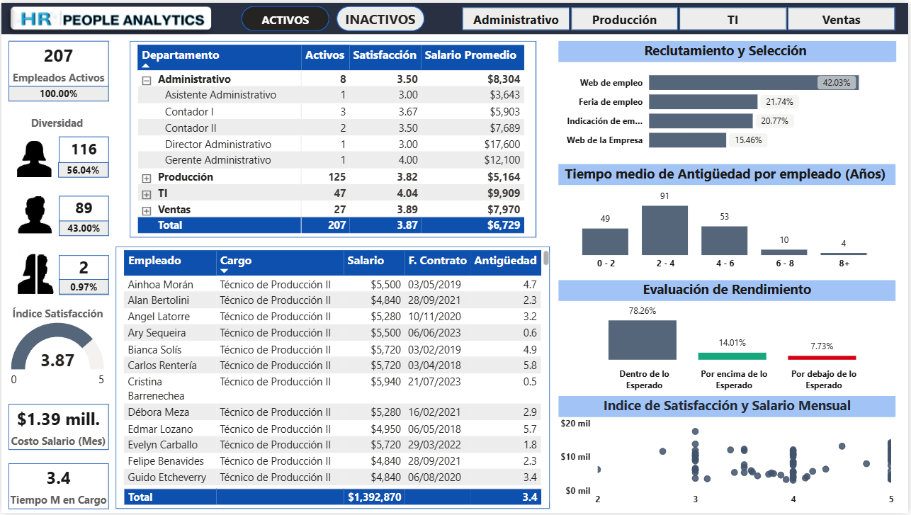
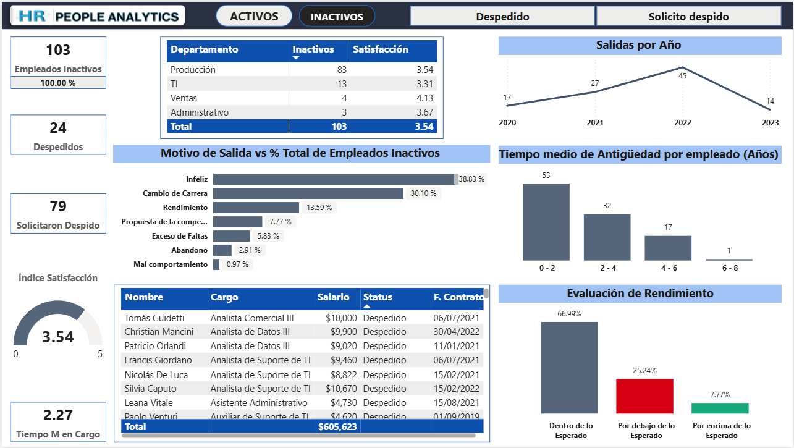

## 📊 People Analytics – Captación y Retención | Power BI Dashboard

### - Ver Dashboard Interactivo
👉 https://app.powerbi.com/view?r=eyJrIjoiODY2NDNmNDAtNDFkYS00YjE4LWIzNWEtNWJmYmQzMzQ3MzhlIiwidCI6Ijc3MDI2YzQzLTFmNWMtNDEyYy1iNjg1LTJkNTM4Y2Q4NWIzMCIsImMiOjR9

### - Ver Tabla de Medidas en DAX
👉 https://github.com/Rubis-Becerra/People-Analytics-Dashboard/blob/main/BC2_People_Analytics.SemanticModel/definition/tables/Tabla_Medidas.tmdl

### - Ver Análisis previo en Excel 
👉 https://github.com/Rubis-Becerra/People-Analytics-Dashboard/tree/main/An%C3%A1lisis%20Excel

---
### 🧠 Contexto del Proyecto
Una empresa de tecnología experimentó un fuerte crecimiento entre 2019 y 2021, impulsado por la expansión de operaciones y el aumento de ingresos. Para sostener esta demanda, la empresa realizó contrataciones masivas. Años después, la organización enfrenta un problema crítico de rotación de personal, con una tasa de facturación elevada en relación con el promedio del mercado (≈5%). Esta situación genera costos innecesarios (reclutamiento, formación, despidos, pérdida de conocimiento e inestabilidad organizacional).

Los socios desean mantener una plantilla objetivo de 210 empleados diversificada y buscan comprender:

Qué está ocurriendo con la retención de talento.  
Cuáles son las causas principales de los despidos.  
Qué áreas requieren acciones prioritarias.

---
### 🎯 Objetivos del Análisis
- Analizar la composición actual del personal y diversidad.
- Evaluar costos de nómina.
- Identificar fuentes de contratación. 
- Analizar rendimiento/desempeño, satisfacción y antigüedad.
- Detectar patrones de rotación y causas de salida.
- Proponer recomendaciones estratégicas basadas en datos.

---
### 🛠️ Herramientas Utilizadas
- **Power BI**: modelado de datos, visualizaciones e interacción.
- **DAX**: métricas de recuentos con filtros, cálculos de porcentajes filtrados, promedio de satisfacción, tiempo medio de duración...
- **Excel / CSV**: fuente de datos, se realiza análisis previo en Excel. 
- **GitHub**: documentación y portfolio.

---
### 📈 Principales KPIs y Métricas Analizadas
- % Totales de empleados activos y diversidad.
- Índice de Satisfacción Promedio.
- Promedio de Salario actual.
- Tiempo promedio de Antiguedad.
- Correlación Salario vs Satisfacción promedio.
- % Totales de empleados inactivos (despedidos y renuncias).
- Motivos de Salida.
- Rendimiento y Pérdida de Talento de Alto Desempeño.

---
### 📸 Views del Dashboard
#### Análisis de Empleados Activos

#### Análisis de Empleados Inactivos

##### Ver todas las Views: https://github.com/Rubis-Becerra/People-Analytics-Dashboard/tree/main/Dash_views

---
### 🔍 Key Business Insights

#### 1️⃣ Insight – Riesgo operativo concentrado
Más del 83% de empleados activos se concentra en Producción y TI, lo que implica que cualquier problema de rotación en estas áreas tiene un impacto directo y significativo en la continuidad operativa del negocio.

#### 2️⃣ Insight – La diversidad de género puede mejorar
Menos del 1% de los empleados activos son de género no binario, esto puede mejorarse implementando búsquedas con lenguaje neutro y sin sesgo de género, participación en ferias de empleo inclusivas e implementando una Política de Diversidad, Equidad e Inclusión (DEI) que incluya fomentar un código de conducta con tolerancia cero a la discriminación.

#### 3️⃣ Insight – La rotación no se debe a un problema salarial
La ausencia de correlación entre salario y satisfacción indica que aumentar compensaciones no resolvería el problema de rotación. Los factores críticos están relacionados con liderazgo, clima y condiciones laborales.

#### 4️⃣ Insight – Producción es el foco crítico de rotación
Producción concentra el 67% de las renuncias, lo que evidencia un problema estructural específico del área y no de la organización en su conjunto.
Más del 32% de las renuncias en base al total inactivo, se deben a insatisfacción laboral (posibles problemas de liderazgo, sobrecarga operativa, falta de planes de desarrollo o reconocimiento) una causa interna y controlable por la empresa, lo que abre una oportunidad clara de intervención.

#### 5️⃣ Insight – Pérdida de talento clave por causas evitables
La salida de empleados de alto desempeño, principalmente por insatisfacción, incrementa el costo oculto de la rotación y pone en riesgo la productividad futura, la mayoría de las pérdidas de talento se concentran en Producción.

#### 6️⃣ Insight – TI como benchmark interno
El alto nivel de satisfacción y menor rotación en TI sugieren la existencia de buenas prácticas replicables en Producción para mejorar la experiencia del empleado.

### 💡 Recomendaciones Estratégicas
- Implementar programas de liderazgo y gestión de personas en Producción.
- Diseñar planes de carrera y crecimiento interno.
- Aplicar encuestas de pulso periódicas por área.
- Revisar cargas de trabajo y procesos operativos.
- Replicar prácticas exitosas del departamento de TI. 

---
### 👩🏻‍💼 Sobre mí
Soy **Ingeniera Civil con experiencia en gestión de proyectos**, actualmente en transición al mundo de **Data Analytics & Business Intelligence** y estudiante de **Ciencia de Datos**.  
Mi enfoque combina análisis de datos con **visión de negocio y toma de decisiones estratégicas**.

📫 **Contacto**
- **LinkedIn**: *www.linkedin.com/in/rubis-becerra*
- **Portfolio Power BI**: *(agregar link)*
- **GitHub**: *https://github.com/Rubis-Becerra/People-Analytics-Dashboard*

💼 **Abierta a oportunidades laborales en posiciones de Analista de Datos y Business Intelligence**.
